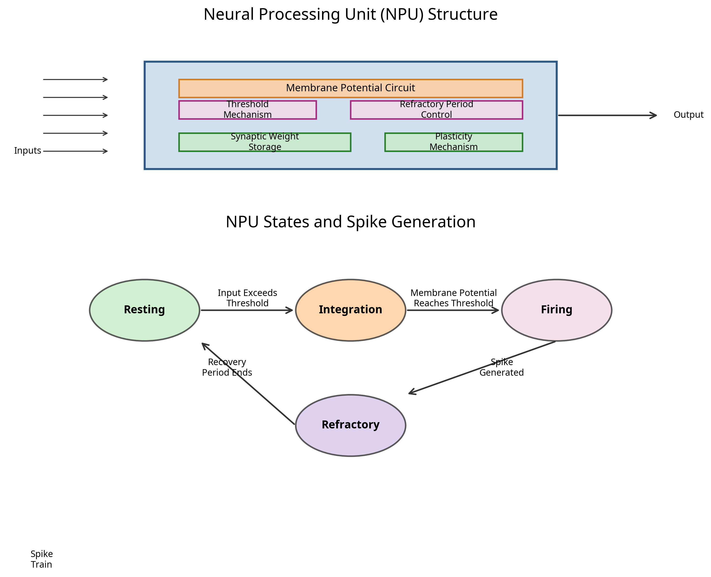
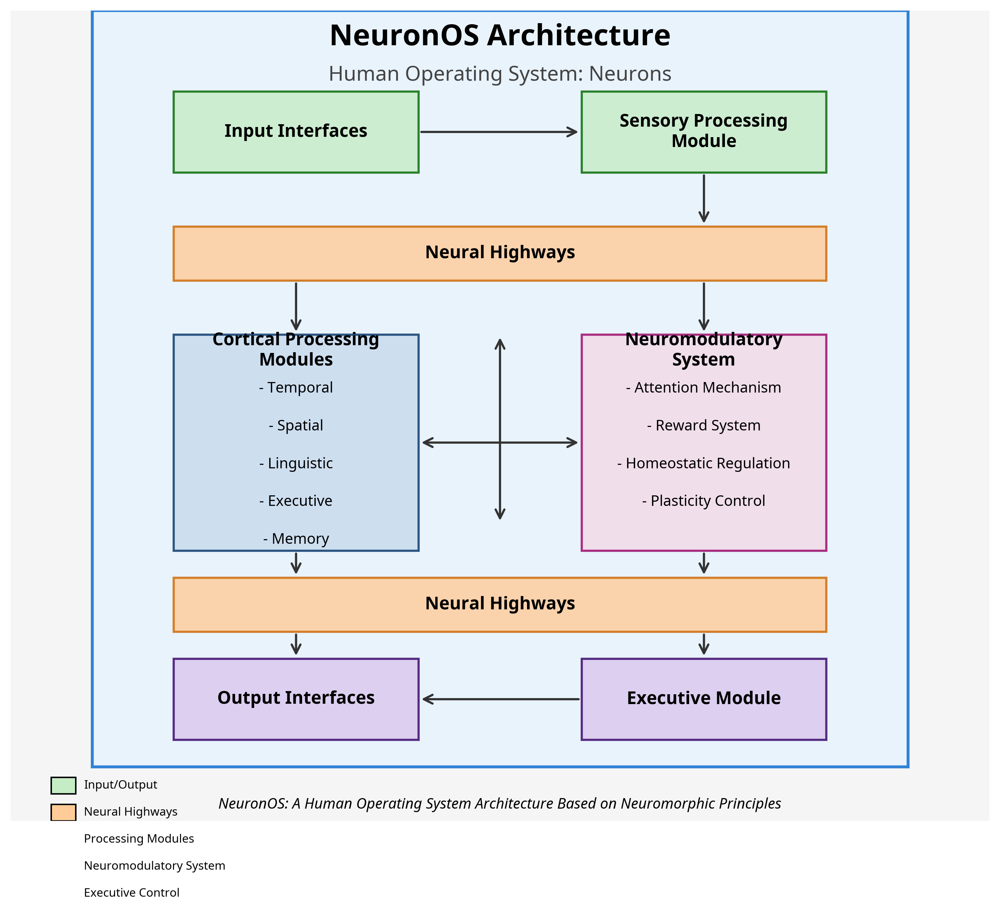

# NeuronOS: A Human Operating System Architecture Based on Neuromorphic Principles

## AI Battle – Advanced AI Architecture Challenge Submission
### Theme: Human Operating System: Neurons

---

## Overview

NeuronOS is an innovative AI architecture that reimagines computing based on the structure and function of the human brain. Drawing inspiration from recent breakthroughs in neuromorphic computing, single-transistor artificial neurons, and synthetic biological intelligence, NeuronOS creates a unified operating system that processes information through interconnected neural modules that mimic the brain's lobar structure.

This architecture addresses the fundamental limitations of traditional von Neumann computing by implementing:
- Parallel processing across specialized neural modules
- Spike-based computation for energy efficiency
- Adaptive plasticity for continuous learning
- Hierarchical organization for both specialized and integrated processing
- Biologically-inspired connectivity patterns

## Repository Structure

```
neuronos/
├── code/
│   ├── npu.py                    # Neural Processing Unit implementation
│   ├── cpm.py                    # Cortical Processing Module implementation
│   ├── neural_highway.py         # Neural Highway implementation
│   ├── neuromodulatory_system.py # Neuromodulatory System implementation
│   └── neuronos.py               # Main NeuronOS integration class
├── visualizations/
│   ├── neuronos_system_architecture.png  # System architecture diagram
│   └── npu_structure_and_states.png      # NPU structure and states diagram
└── docs/
    ├── neuronos_concept.md                  # Concept overview
    ├── neuronos_detailed_structure.md       # Detailed structure documentation
    ├── neuronos_theoretical_foundations.md  # Theoretical foundations
    ├── neuronos_scalability_optimization.md # Scalability and optimization
    └── neuronos_feasibility_assessment.md   # Feasibility assessment
```

## Architecture Components

### 1. Neural Processing Unit (NPU)

The fundamental computational units of NeuronOS are Neural Processing Units (NPUs) based on the breakthrough single-transistor artificial neuron technology. Each NPU can function as both a neuron and a synapse, dramatically reducing hardware complexity while maintaining biological fidelity.

#### NPU Structure

Each NPU contains:
- **Membrane Potential Circuit**: Integrates incoming signals over time
- **Threshold Mechanism**: Triggers spike generation when membrane potential exceeds threshold
- **Refractory Period Control**: Prevents rapid re-firing after spike generation
- **Synaptic Weight Storage**: Maintains connection strength values
- **Plasticity Mechanism**: Modifies synaptic weights based on activity patterns

#### NPU States

Each NPU operates in one of four states:
1. **Resting State**: Low energy consumption, monitoring inputs
2. **Integration State**: Accumulating input signals
3. **Firing State**: Generating output spike
4. **Refractory State**: Temporarily inactive after firing



### 2. Cortical Processing Modules (CPMs)

NPUs are organized into Cortical Processing Modules (CPMs), specialized functional units that process specific types of information. Inspired by the lobar structure of the human brain, each CPM contains thousands to millions of interconnected NPUs organized in a hierarchical structure.

#### CPM Types

The primary CPMs include:
- **Sensory Processing Module**: Handles input data processing (visual, auditory, etc.)
- **Temporal Processing Module**: Manages time-series data and sequential processing
- **Spatial Processing Module**: Handles spatial relationships and navigation
- **Linguistic Processing Module**: Processes language and symbolic information
- **Executive Module**: Coordinates activity across other modules and manages goal-directed behavior
- **Memory Module**: Implements both working and long-term memory systems

### 3. Neural Highways

CPMs communicate through Neural Highways, high-bandwidth pathways that transmit spike-based signals between modules. These pathways implement:

- **Bidirectional Information Flow**: Enabling feedback and feedforward communication
- **Priority-Based Routing**: Prioritizing important information
- **Adaptive Bandwidth Allocation**: Adjusting capacity based on demand
- **Signal Synchronization Mechanisms**: Coordinating timing across the system

### 4. Neuromodulatory System

The Neuromodulatory System regulates global system states and learning processes, inspired by neurotransmitters in the human brain. This system includes:

- **Attention Mechanism**: Focuses computational resources on relevant inputs
- **Reward System**: Reinforces successful processing patterns
- **Homeostatic Regulation**: Maintains system stability and prevents runaway activation
- **Plasticity Control**: Modulates learning rates across the system



## Code Implementation

### Neural Processing Unit (npu.py)

The NPU implementation includes:
- Membrane potential dynamics following leaky integrate-and-fire model
- Spike generation and transmission
- Refractory period handling
- Spike-Timing-Dependent Plasticity (STDP) for learning

```python
# Example of NPU update method
def update(self, current_time, time_step):
    """
    Update the NPU state for the current time step.
    
    Args:
        current_time: Current simulation time (ms)
        time_step: Duration of time step (ms)
        
    Returns:
        List of (target_id, spike_time) tuples if the NPU fires, empty list otherwise
    """
    output_spikes = []
    
    # Handle refractory period
    if self.state == NPUState.REFRACTORY:
        self.refractory_time_remaining -= time_step
        if self.refractory_time_remaining <= 0:
            self.state = NPUState.RESTING
            self.refractory_time_remaining = 0
            
    # Process incoming spikes and update membrane potential
    # ...
    
    # Check for threshold crossing
    if self.membrane_potential >= self.threshold:
        # Generate spike
        # ...
        
    return output_spikes
```

### Cortical Processing Module (cpm.py)

The CPM implementation includes:
- Organization of NPUs into hierarchical layers
- Specialized processing based on module type
- Input processing and output generation
- Local modulation based on neuromodulatory signals

### Neural Highway (neural_highway.py)

The Neural Highway implementation includes:
- Priority-based routing of spike signals
- Bandwidth management and congestion detection
- Adaptive routing based on traffic patterns
- Connection topology management

### Neuromodulatory System (neuromodulatory_system.py)

The Neuromodulatory System implementation includes:
- Attention mechanisms for focusing computational resources
- Reward signaling for reinforcement learning
- Homeostatic regulation for system stability
- Plasticity control for learning rate modulation

### NeuronOS Integration (neuronos.py)

The main NeuronOS class integrates all components and provides:
- System initialization and configuration
- Input processing and output generation
- Simulation control and execution
- System state monitoring and reporting

## Usage Example

```python
# Create NeuronOS instance
neuronos = NeuronOS()

# Create a simple input sequence
input_sequence = []
for t in range(100):
    # Random binary input pattern
    input_values = np.random.rand(100) > 0.9
    input_data = {'visual_input': input_values.astype(float)}
    input_sequence.append(input_data)

# Run simulation
outputs = neuronos.run_simulation(input_sequence, duration=100.0)

# Provide reward and focus attention
neuronos.provide_reward(0.8)  # Positive reward
neuronos.focus_attention({'executive_0': 0.9, 'memory_0': 0.7})  # Focus attention
```

## Theoretical Foundations

NeuronOS is grounded in several theoretical frameworks:

1. **Predictive Processing Theory**: The brain constantly generates predictions about incoming sensory data and updates its models based on prediction errors.

2. **Free Energy Principle**: Biological systems minimize "surprise" (or free energy) by either changing their models of the world or changing the world to match their models.

3. **Neural Darwinism**: Neural circuits compete for resources, with successful circuits being strengthened.

4. **Integrated Information Theory**: Consciousness arises from integrated information across different processing domains.

## Scalability and Optimization

NeuronOS is designed with inherent scalability through its hierarchical organization:

- **Vertical Scaling (Depth)**: Adding more processing layers within CPMs
- **Horizontal Scaling (Width)**: Increasing the number of NPUs and specialized CPMs
- **System-Level Scaling**: Networking multiple NeuronOS instances together

Optimization techniques include:
- **Hardware-Level**: Analog computation, mixed-signal design, 3D integration
- **Algorithm-Level**: Sparse activation, event-driven processing, predictive processing
- **System-Level**: Dynamic resource allocation, task prioritization, sleep-like states

## Performance Comparison

| Metric                   | NeuronOS                | Traditional DNNs         | Improvement Factor |
|--------------------------|-------------------------|--------------------------|-------------------|
| Energy Efficiency        | 10¹² ops/watt           | 10⁹ ops/watt             | 1,000x            |
| Memory Requirements      | 1 byte per parameter    | 4-8 bytes per parameter  | 4-8x              |
| Adaptability             | Continuous learning     | Requires retraining      | Qualitative       |
| Fault Tolerance          | Graceful degradation    | Catastrophic failure     | Qualitative       |
| Inference Latency        | Milliseconds            | 10s-100s of milliseconds | 10-100x           |

## Implementation Roadmap

### Phase 1: Foundation Development (Years 1-2)
- NPU Prototype development and validation
- Small-scale CPM implementation
- Simulation environment creation
- Initial applications in pattern recognition and control systems

### Phase 2: Scaling and Integration (Years 3-5)
- Scaling to millions of NPUs
- Multiple CPM integration
- Neural Highway optimization
- Application expansion to NLP, complex control systems, and medical applications

### Phase 3: Mass Deployment (Years 5+)
- Full-scale implementation
- Manufacturing optimization
- Advanced feature implementation
- Widespread application in consumer products, enterprise systems, and critical infrastructure

## Conclusion

NeuronOS represents a fundamental reimagining of computing architecture based on the principles of human neural processing. By implementing a hierarchical, modular system of spike-based neural processors with adaptive connectivity and neuromodulatory control, it offers unprecedented efficiency, adaptability, and scalability.

The architecture addresses the limitations of both traditional computing and current AI approaches, providing a pathway toward more human-like artificial intelligence that can learn continuously, adapt to changing conditions, and operate with exceptional energy efficiency.

---

## Getting Started

### Prerequisites
- Python 3.8+
- NumPy
- Matplotlib (for visualizations)

### Installation
1. Clone this repository
2. Install required packages: `pip install numpy matplotlib`

### Running the Example
```python
from neuronos import NeuronOS

# Create and run a simple simulation
neuronos = NeuronOS()
input_sequence = [{'input': [1.0, 0.0, 1.0, 0.0]} for _ in range(10)]
outputs = neuronos.run_simulation(input_sequence)
print(outputs)
```

---

## License
This project is licensed under the MIT License - see the LICENSE file for details.

## Acknowledgments
- Inspired by recent breakthroughs in neuromorphic computing and brain research
- Based on principles from neuroscience, cognitive science, and computer architecture
